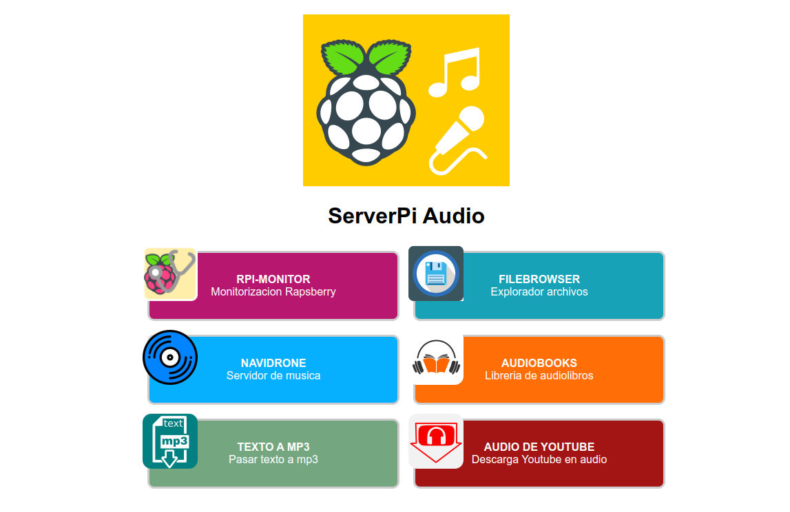

# SERVIDOR DE AUDIOS SOBRE RAPSBERRY PI

Se trata de combinar varios servicios sobre una Raspberry como servidor de audio, para ellos uso algunos proyectos de terceros o otros propios



Un servicio textToAudio con un interface web que permite convertir texto a audio, detalle de este servicio en:

Un segundo servicio  permite descarcar audios de youtube mas detalle del proyecto

El imprescindible Filebrowser como gestor de archivos para subir o descargar.

Y todos estos audios están disponible a traves de Navidrome como listas y reproductor.

Y una pagina de arranque a modo de menu para acceder a los servicios

## instalación

Debemos de tener un rapsberry con docker y docker-compose instalado si no sabes como en este post esta explicado. 

mi raspberry lo tengo con una ip fija en 192.168.1.100, si la tuya es diferente, deberás de cambiar el docker-compose.yml y el menu.js de statPage

para ejecutarlos simplemente ejecutar:

```

git clone .
docker-compose up -d

```

y entrado en tu navegador a http://192.168.1.100